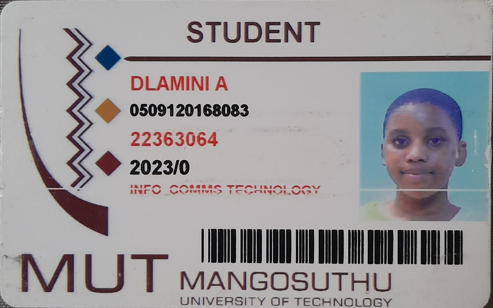

## Full Name: AKHONA DLAMINI 
## Student Number: 22363064

# BRIEF DESCRIPTION
This is a fake National Lottery Simulator which mimics the South African National Lottery experience using HTML, CSS, and vanilla JavaScript.
The key features include: A Credits System which starts with 250 credits each board costs 25 credits, credits update dynamically after purchases
and winnings. Board Purchase and Number Selection which allows users to buy 1-10 boards, each board displays a grid of numbers (1-20) where players
select exactly 6 numbers. Finalization and Draw - boards must be finalized before drawing, start draw button generates 6 unique winning numbers (1-20).
Winnings Calculation displays payouts based on matches, the results are displayed per board with color-coded match counts. Draw History which logs past
draws with timestamps, winning numbers, and total winnings. Reset Option which fully resets the game to initial state.

# ADDITIONAL FEATURES
There are no additional features i have added.

# REQUIRED FEATURES
I implemented all the required features.

# AI Tools Used (50%)
I used Chatgpt and DeepSeek for my JavaScript code to create functions and event listeners, these AI tools also helped me in refining my HTML structure to 
be more user friendly.

# % Provided by Peers